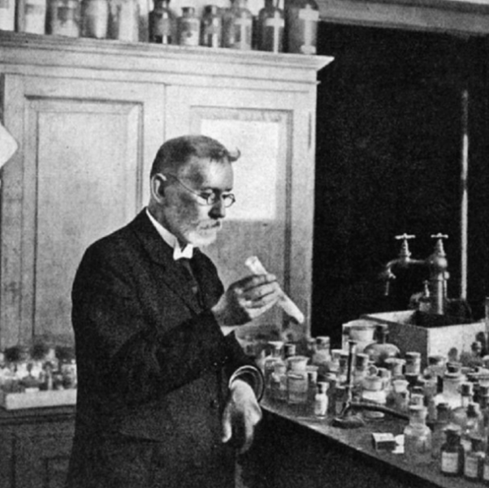
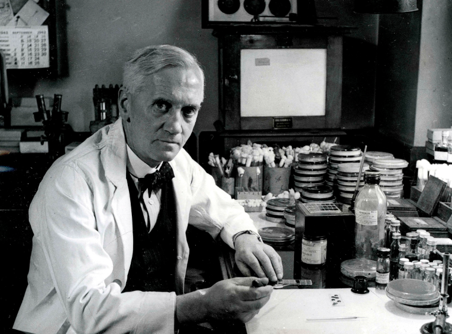
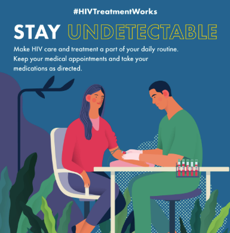

# Introduction: Antibiotics — The Medical Miracle

## Medicine in the Pre-Antibiotic Era

Prior to the availability of antibiotics, medicine was largely a process
of **prognostication** rather than intervention. Physicians could
predict the course of infectious diseases but had little ability to
alter outcomes. Treatments were rudimentary and often ineffective —
prescriptions frequently consisted of alcohol-based preparations such as
*spiritus frumenti* (whiskey) or high-proof herbal tonics like Jamaican
ginger (90% alcohol).

::: {layout-ncol="2"}
{width="90%" fig-align="center"}

{width="50%" fig-align="center"}
:::

## Dawn of Antibiotic Discovery

Although evidence suggests antibiotic-like substances were used by
ancient civilizations — Egyptians produced tetracycline-containing beer
using *Streptomyces*-contaminated grain, and the Greeks and Chinese
employed various antimicrobial remedies — the first truly effective
systemic antibiotics emerged in the early 20th century.

| **Paul Ehrlich** (1909) Salvarsan — first treatment for syphilis; highly toxic, required skilled administration | **Alexander Fleming** (1929) Penicillin discovery; purified and tested by Florey, Chain & Heatley (1940) | **Gerhard Domagk** (1931) Sulfonamides — discovered through textile dye research; treated his own daughter's severe cellulitis before human trials |
|----|----|----|
| {width="250"} | {width="350"} | {width="220"} |

: The three founding figures of modern antibiotic therapy. {.striped}

## Mortality Reduction with Antibiotic Therapy

The impact of antibiotics on mortality from common infectious diseases
is unparalleled by any other class of therapeutic drugs — far exceeding
the impact of treatments for myocardial infarction, stroke, or cancer.

| Disease | Pre-antibiotic era | Antibiotic era | Mortality reduction |
|----|:--:|:--:|:--:|
| Community-acquired pneumonia | \~35% | \~10% | **−25%** |
| Nosocomial pneumonia | \~60% | \~30% | **−30%** |
| Bacterial endocarditis | \~100% | \~25% | **−75%** |
| Gram-negative bacteremia | \~70% | \~10% | **−60%** |
| Bacterial meningitis | \>80% | \<20% | **−60%** |
| Cellulitis | \~11% | \<0.5% | **−10.5%** |

: Comparison of mortality rates before and after the availability of
antibiotic therapy. Adapted from Spellberg [@spellberg2025]. {.hover
.striped}

## Antibiotics: Essential for Modern Medicine

Beyond treating infections directly, antibiotics enable virtually every
aspect of modern interventional medicine:

-   **Complex surgery** — deeply invasive and prolonged surgical
    procedures
-   **Cancer chemotherapy** — aggressive cytotoxic regimens that
    suppress immunity
-   **Critical care** — maintenance of patients with central venous
    catheters, mechanical ventilation
-   **Neonatal medicine** — care for premature infants and mothers with
    post-partum sepsis
-   **Transplantation** — solid organ and stem cell transplantation

> Antibiotics created a revolution in the practice of medicine,
> transforming a primarily diagnostic-focused field into a *therapeutic,
> interventional* profession. [@spellberg2025]

Without effective antibiotics, medicine would regress approximately 100
years — losing the ability to safely perform these procedures.

------------------------------------------------------------------------

# The Antimicrobial Resistance Crisis

## Global Impact of Resistance

Antimicrobial resistance (AMR) represents one of the most significant
threats to global public health. Current global statistics reveal the
scale of the problem:

-   **21.6 million** deaths due to sepsis annually
-   **7.75 million** deaths due to bacterial infections
-   **4.7 million** deaths *associated* with resistance (requiring less
    effective or more toxic antibiotics)
-   **\>1 million** deaths directly *attributable* to resistance

In **Italy** specifically, approximately **8,000 deaths per year** are
attributable to antibiotic-resistant infections — a figure that receives
remarkably little public attention relative to its magnitude.

## WHO Priority Pathogen List

The World Health Organization has classified resistant pathogens into
three priority tiers to guide research and development of new
antibiotics:

{fig-align="center" width="70%"}

### Critical Priority (all Gram-negatives)

These are pathogens typically acquired by hospitalized,
immunocompromised, or critically ill patients, often emerging after
multiple courses of antibiotic therapy:

-   ***Acinetobacter baumannii*** — often begins as colonization in
    ventilated or burn patients; progresses to pneumonia, bloodstream
    infection, and sepsis; frequently multi-drug resistant (MDR) and
    sometimes pan-drug resistant (PDR)
-   ***Pseudomonas aeruginosa*** — associated with immunocompromised and
    critically ill patients; commonly MDR
-   **Carbapenem-resistant Enterobacterales** — *E. coli*, *Klebsiella
    pneumoniae*, *Enterobacter* spp. — the most common causes of urinary
    tract infections and bloodstream infections, now increasingly
    resistant to carbapenems (previously considered last-line agents)

## Resistance Rates in Italy and Europe

### Methicillin-resistant *Staphylococcus aureus* (MRSA)

{fig-align="center" width="90%"}

In Italy, **25–50% of *S. aureus* isolates are methicillin-resistant**,
necessitating the use of intravenous antibiotics such as vancomycin or
daptomycin that are more toxic, more expensive, and require prolonged
hospitalization compared to oral alternatives available for
methicillin-susceptible strains.

### Carbapenem-resistant Enterobacterales (CRE)

{fig-align="center" width="90%"}

**Up to 25% of *Klebsiella pneumoniae*** hospital isolates in Italy are
resistant to carbapenems. This has transformed the mortality of common
Gram-negative bloodstream infections from approximately 8–10% to
**40–50%**, because physicians must resort to less effective combination
regimens.

### Multi-drug Resistant *Acinetobacter baumannii*

{fig-align="center" width="90%"}

::: callout-note
## Why are Northern European countries doing better?

Sweden, Norway, and Denmark have lower resistance rates due to: (1)
lower per-capita antibiotic use, (2) stricter infection control
practices, (3) modern hospital infrastructure with single-patient rooms.
However, resistance travels with people — international travel and
migration disseminate resistant organisms globally.
:::

## The Antibiotic Discovery Pipeline Is Slowing

{fig-align="center"
width="85%"}

Antibiotic development is declining because:

-   **High cost and risk** — developing a new antibiotic costs
    approximately \$1 billion
-   **Poor return on investment** — hospitals appropriately restrict new
    antibiotics to preserve them, reducing sales
-   **Competition with profitable drug classes** — antibiotics cannot
    compete commercially with GLP-1 inhibitors, statins, or other drugs
    taken daily for life
-   **No novel mechanisms** — recent approvals are iterations of
    existing classes, not truly new drug classes

New funding models are needed. Italy has passed measures supporting a
"Netflix model" — paying a subscription fee to ensure antibiotics are
available when needed, regardless of usage volume. Antibiotics should be
thought of like fire extinguishers: you hope you never need them, but
someone must pay to keep them functional.

## Antibiotics Are a Societal Trust

> Antibiotic overprescription is a ***tragedy of the commons***: an
> individual undertakes an action perceived to be in their own
> self-interest that causes harm to society at large.

-   **\>1/3 of community antibiotic prescriptions** are inappropriate
-   **Up to 50% of hospital antibiotic prescriptions** may be
    inappropriate
-   Each inappropriate prescription individually causes minimal harm,
    but collectively the effect is catastrophic

**One of the most important functions of the physician is to serve as an
expert steward — both using antibiotics effectively and protecting their
efficacy for future patients.**

------------------------------------------------------------------------

# The Ten Principles of Effective Antibiotic Therapy

::: callout-important
## Overview of the 10 Principles

1.  Develop an accurate differential diagnosis
2.  Only use antibiotics when they alter the clinical course
3.  Empirically target microbes in the differential diagnosis
4.  Use a lower threshold for empirical therapy in critically ill
    patients
5.  Host factors affect the spectrum of empirical therapy
6.  Use PK/PD principles to optimize treatment selection and dosing
7.  De-escalate therapy based on microbiology results and clinical
    response
8.  If therapy is not working, consider source control or alternative
    diagnosis before broadening
9.  Distinguish new infection from failure of initial therapy
10. Duration of therapy should be as short as possible based on evidence
:::

**This handout covers Principles 1–6 in detail, as presented in the
lecture.**

------------------------------------------------------------------------

# Principle 1: Develop an Accurate Differential Diagnosis

## The Medical History Is 80% of Diagnosis

In infectious diseases, the **patient's medical history** — not imaging,
biomarkers, or even microbiological tests — is the single most important
diagnostic tool. This may seem counterintuitive, but there are important
reasons:

-   Microbiological tests, while confirmatory, are **not perfectly
    sensitive or specific**
-   Ordering tests in patients with low pre-test probability leads to
    **false positives** that can trigger unnecessary invasive procedures
    or toxic treatments
-   Broad-panel testing without clinical context produces **incidental
    findings** that mislead clinicians

### Key Elements of the Infectious Disease History

-   **Current symptoms** — assessed using the **8 cardinal
    descriptors**: Timing, Location, Character, Aggravating factors,
    Alleviating factors, Associated symptoms, Severity, Setting
-   **Fever** — height, duration, pattern (continuous, intermittent,
    relapsing)
-   **Risk factors** — indwelling devices (urinary catheters, vascular
    catheters, prosthetic joints, cardiac devices), recent procedures,
    immunosuppression, diabetes, injection drug use, previous infections
-   **Travel and exposure history** — countries, regions (urban vs.
    rural), dates, animal or insect exposure, contact with ill
    individuals, consumption of potentially contaminated food/water
-   **Sexual history** and STI risk
-   **Vaccination history**
-   **Past medical, surgical, medication history, and allergies**
-   **Recent antibiotic use**
-   **Social history** — long-term care facility residence, occupation,
    hobbies, substance use, unusual exposures

## Case Example: The Importance of History

### Clinical Presentation

A **34-year-old farmer from Sicily** presents with worsening back pain
after sitting for more than a couple of hours. MRI reveals evidence of
inflammation and septic discitis at the L4 vertebral body, suggesting
spondylitis.

::: {layout-ncol="2"}
#### Standard Spondylitis Etiologies

The most common causes of vertebral osteomyelitis/spondylitis are:

-   **\>50%**: *Staphylococcus aureus*, *S. epidermidis*
-   **\~25%**: *Streptococcus* spp., *Enterococcus* spp., *Pseudomonas
    aeruginosa*, Enterobacterales, anaerobes, *Mycobacterium
    tuberculosis* (Pott's disease)

These are typically **hematogenously spread** infections, classically
occurring in hospitalized patients after central venous catheter use or
staphylococcal bacteremia.

{fig-align="center" width="90%"}
:::

### The History Changes Everything

Pertinent history reveals:

-   Patient is a **sheep and cattle farmer** producing milk and cheese
    (Pecorino salato and Ricotta)
-   Pain began after a **"bad case of flu"** with fever, achy joints,
    and headache
-   **Father** (also works on the farm) has **worsening hip pain** —
    being evaluated for hip replacement
-   From an **endemic area** for zoonotic infections in southern Italy

![Brucellosis epidemiology in Italy — a zoonotic Gram-negative
coccobacillus transmitted through contact with livestock and
unpasteurized dairy products
[@massis2005].](images/brucellosis.png){fig-align="center" width="70%"}

### Diagnosis: Brucellosis Spondylitis

The standard diagnostic workup and treatment for staphylococcal
spondylitis would **completely miss** this diagnosis:

| Aspect | Standard spondylitis | Brucellosis spondylitis |
|----|----|----|
| Blood cultures | Standard incubation | **Prolonged incubation** required; bone marrow biopsy may be needed |
| Specific tests | Not required | **Brucella PCR**, combination serologic studies |
| Treatment | Vancomycin or anti-staphylococcal agents | **Gentamicin + Doxycycline + Rifampin** — completely unconventional |

: Comparison highlighting how history-driven diagnosis changes the
entire diagnostic and therapeutic approach.

**Key teaching point**: The history informed everything — from
diagnostic test selection to treatment. Starting empirical vancomycin
(the standard approach) would have been completely ineffective against
Brucella.

## Antibiotics Are Usually Started Empirically

In practice, antibiotic therapy is initiated **before** microbiological
results are available, because the most critical window for treatment is
the first 24–48 hours when bacterial inoculum is highest and patients
are sickest.

### Timeline from Suspicion to Definitive Therapy

| Time | Step | Action |
|----|----|----|
| **0 hours** | Suspect infection | Clinical assessment |
| **\~1 hour** | Culture suspected sites | **Begin empiric therapy** for likely pathogens |
| **\~24 hours** | Gram stain results | Preliminary guidance for therapy adjustment |
| **36–48 hours** | Pathogen identification | Consider narrowing therapy |
| **72–96 hours** | Susceptibility results | **Switch to definitive therapy** |

### The Problem of Empirical Overuse

Because empirical therapy is started before diagnosis, this inherently
leads to **overuse**:

-   **\>90% of upper respiratory tract infections** are viral and should
    not be treated with antibiotics
-   Clinicians frequently **overestimate** the risk of bacterial
    infection
-   Clinicians frequently **underestimate** the risks of antibiotic
    therapy

![Overlap between bacterial and viral upper respiratory tract infections
— the vast majority are viral and do not require antibiotics
[@chow2012].](images/URI.png){fig-align="center" width="55%"}

## Risks of Antibiotic Therapy Are Underappreciated

::: callout-warning
## Key Statistics

-   **1 in 5 patients** given an antibiotic prescription develops an
    adverse event or superinfection (resistant pathogens or
    *Clostridioides difficile*)
-   Each additional **10 days** of antibiotic therapy confers a **3%
    increased risk** of an adverse drug effect
:::

This results from a combination of (1) **fear from diagnostic
uncertainty**, and (2) **lack of appreciation for how dangerous
antibiotics can be** [@tamma2017b].

### Most Common Antibiotic-Associated Adverse Events in Hospitalized Patients

![30-day antibiotic-associated adverse events in hospitalized patients
receiving systemic therapy. Gastrointestinal effects are most common,
followed by hematological effects (thrombocytopenia, granulocytopenia in
up to 2%), and renal or neurological toxicities. Certain drug classes
(aminoglycosides, vancomycin) carry particularly high renal injury risk
[@tamma2017b].](images/adverseeffects.png){fig-align="center"
width="75%"}

## Positive Cultures Are Not Always Proof of Infection

A positive culture in the **absence of signs and symptoms of infection**
should **not** reflexively trigger antibiotic therapy. Without clinical
symptoms, positive cultures often represent **colonization or
contamination**.

Common offenders include:

| Sample type | Problem |
|----|----|
| **Superficial wound swabs** | Sample skin flora, not the pathogen causing deep infection; deep tissue biopsy at infection margins is required |
| **Urine cultures** | Catheterized patients always have positive cultures; asymptomatic bacteriuria should not be treated |
| **Bronchoalveolar lavage** | Can become contaminated with oral flora during bronchoscope withdrawal |
| **Respiratory samples** | Low positive predictive value without compatible symptoms |
| **Stool cultures** | Unreliable without active diarrhea at time of collection |

### Diagnostic Stewardship Works

Simple interventions can dramatically reduce inappropriate testing. A
study by Luu et al. placed reminders at nursing stations with key
messages:

> *Stop sending urine cultures for everything nosocomial. Cystitis
> doesn't cause fevers. Urine from the catheter is not sterile. A
> positive urine culture does not equal infection.*

![Results of a diagnostic stewardship intervention: reduced urine
cultures, decreased catheter-associated UTIs over time, and no effect on
mortality [@luu2021].](images/outcomes.png){fig-align="center"
width="75%"}

------------------------------------------------------------------------

# Principle 2: Only Use Antibiotics When They Alter the Clinical Course

## Antibiotics Are Not the Only Answer

The administration of antibiotics should not be a reflexive response to
infection. It should be incorporated into an **overall, rational
therapeutic plan**. Key considerations:

-   Patients without bacterial infections **cannot** have their clinical
    course improved by antibiotics
-   Some infections **require non-antibiotic interventions first**
    before antibiotics will be effective

### Classic Example: Osteomyelitis with Exposed Bone

{fig-align="center" width="25%"}

If the bone remains exposed, starting antibiotics will:

1.  Fail to clear the infection
2.  Select for increasingly resistant organisms
3.  Leave the patient with an untreatable MDR bone infection

The proper approach: achieve **surgical closure/source control** first,
then initiate appropriate antibiotic therapy.

## Ethical Dilemmas

Two common ethical scenarios:

| End-of-life care | Non-adherent HIV therapy |
|:--:|:--:|
| {width="300"} | {width="300"} |
| Should infections be treated aggressively in terminally ill patients? Generally yes for comfort, but the extent of treatment for MDR infections in terminal stages remains debated. | If a patient is non-adherent, antibiotic/antiviral therapy risks transforming their infection into a resistant, untreatable, and potentially transmissible disease. |

------------------------------------------------------------------------

# Principle 3: Empirically Target Microbes in the Differential Diagnosis

## Know the Spectrum of Activity

To select appropriate empiric therapy, clinicians must know which
antibiotics cover which pathogens. The **Sanford Guide**
([web.sanfordguide.com](https://web.sanfordguide.com/)) provides
comprehensive antimicrobial spectra tables using a grading system:

-   **++** (double plus) — good activity with clinical evidence from
    trials
-   **+** (green) — good *in vitro* activity expected to be effective,
    but possibly lacking clinical trial data for the specific indication
-   **±** (yellow/borderline) — resistance or pharmacokinetic concerns;
    unreliable
-   **0** (red) — ineffective; do not use

### The Impact of Resistance on Treatment Options

Consider the dramatic narrowing of treatment options with increasing
resistance in *E. coli*:

| Resistance phenotype | Available options | Key drugs remaining |
|----|----|----|
| **Susceptible *E. coli*** | Many options across multiple classes | Amoxicillin-clavulanate, piperacillin-tazobactam, cephalosporins, carbapenems, fluoroquinolones |
| **ESBL-producing *E. coli*** (25–30% of hospital isolates) | Dramatically reduced | Primarily **carbapenems** |
| **KPC/MBL carbapenemase-producing *E. coli*** | Only 1–2 options, none with strong clinical evidence | Newer agents (ceftazidime-avibactam, cefiderocol) with limited clinical data |

## Community-Acquired vs. Nosocomial Infections

The single most important question in selecting empiric therapy is:
**where was this infection acquired?**

{fig-align="center"
width="85%"}

| Feature | Community infections | Nosocomial infections |
|----|----|----|
| MDR Gram-negatives | Infrequent | Common |
| MRSA risk | Low (unless specific risk factors) | High, especially with recent antibiotic use |
| Typical pathogens | *S. pneumoniae*, *H. influenzae*, *M. catarrhalis*, atypical pathogens | *Pseudomonas*, MRSA, non-fermenting Gram-negatives, Enterobacterales |
| Empiric approach | Narrow-spectrum oral therapy often sufficient | IV broad-spectrum therapy, consider ESBL/CRE coverage |
| Last-line agents | Reserve (e.g., fluoroquinolones) | May need as first-line |

: Key differences in empiric therapy based on site of infection
acquisition.

::: callout-note
## Exceptions

Community-acquired infections may be caused by *Pseudomonas* in patients
with cystic fibrosis, bronchiectasis, chronic dialysis, indwelling
catheters, or recent surgery.
:::

------------------------------------------------------------------------

# Principle 4: Lower Threshold for Empirical Therapy in Critically Ill Patients

## Antibiotic Timing Is Critical in Septic Shock

In critically ill patients with sepsis, there is no time for prolonged
diagnostic deliberation. Observational evidence demonstrates that **each
hour of delay** in administering appropriate antimicrobial therapy
**increases the risk of death**.

![The Kumar study: survival fraction decreases as the time from
hypotension onset to effective antibiotic administration increases. This
landmark paper established the principle that antibiotic timing is
critical in septic shock
[@kumar2006].](images/kumar.png){fig-align="center" width="85%"}

### Key Clinical Actions in Septic Shock

1.  **Obtain blood cultures** before starting antibiotics — this is your
    best chance for a microbiological diagnosis (sensitivity drops after
    antibiotics are started)
2.  **Start broad-spectrum empirical therapy immediately** — a
    carbapenem or other broad-spectrum regimen
3.  **Ensure subsequent doses are administered on time** — the first AND
    second doses are critical
4.  De-escalate once culture results are available

::: callout-warning
## Clinical Pearl

In septic patients, you may need to start broader empirical therapy than
you would in a stable patient. The risk of undertreating a critically
ill patient with an inadequate antibiotic far outweighs the collateral
damage of temporary broad-spectrum therapy.
:::

------------------------------------------------------------------------

# Principle 5: Host Factors Affect the Spectrum of Empirical Therapy

## Immunocompromise Changes the Differential Diagnosis

The "flavor" of immunosuppression determines the types of pathogens that
must be considered:

{fig-align="center" width="85%"}

**Key question**: Does this patient have impaired **cell-mediated
immunity**? If so:

-   **Acute presentation** → viral infections, common bacteria,
    **intracellular bacteria** (Legionella, Listeria, Salmonella Typhi,
    Nocardia)
-   **Delayed/subacute presentation** → **fungal infections** (Candida,
    Aspergillus), parasites
-   Standard β-lactams **will not cover** intracellular pathogens

### Common Immunocompromising Conditions

1.  Chronic diseases (type 1 diabetes, COPD)
2.  Autoimmune diseases (lupus, rheumatoid arthritis)
3.  Primary immunodeficiencies
4.  Cancer and/or chemotherapy
5.  HIV
6.  Solid organ or bone marrow transplant
7.  Advanced age
8.  Malnutrition
9.  **Chronic corticosteroid use or other immunosuppressive
    medications**
10. Chronic infections
11. Smoking (impaired ciliary response)

## Glucocorticoids: The "Credit Cards" of Immunosuppressive Therapy

Corticosteroids provide **immediate anti-inflammatory benefit** (like a
credit card) but accrue a compounding "debt" of immunosuppression — the
bill comes due as **opportunistic infections**.

![Dose-dependent risk of opportunistic infections with glucocorticoid
use — significant risk begins at \>10 mg prednisone equivalents (PEQ)
per day for 2–4 weeks
[@chastain2023].](images/glucocorticoids.png){fig-align="center"
width="55%"}

### Case Example: Hidden Immunosuppression

A patient with **pulmonary sarcoidosis** on 10 mg/day prednisone
presents with community-acquired pneumonia (diffuse bilateral
infiltrates). Initial empiric therapy for typical CAP (*S. pneumoniae*)
is started, but the patient deteriorates. Bronchoscopy eventually
reveals ***Pneumocystis jirovecii*** **pneumonia (PCP)** — an
opportunistic infection typically seen in bone marrow transplant
recipients or advanced HIV patients, but here caused by chronic low-dose
steroid use.

::: {layout-ncol="2"}
{fig-align="center"
width="90%"}

{fig-align="center" width="90%"}
:::

::: callout-tip
## Clinical Pearl

Always ask about corticosteroid use — even low doses (\>10 mg prednisone
equivalents daily) for prolonged periods can cause clinically
significant immunosuppression. Consider PCP prophylaxis in patients on
prolonged steroids. For a comprehensive review, see Chastain et al.,
*Clin Infect Dis* 2023 [@chastain2023].
:::

------------------------------------------------------------------------

# Principle 6: Use PK/PD Principles to Optimize Treatment Selection and Dosing

## It's Not Enough to Pick the Right Drug

Selecting an antibiotic with appropriate **pharmacodynamic** (PD)
activity — the right spectrum — is only half the equation. You must also
consider the **pharmacokinetic** (PK) properties: does the drug reach
the site of infection at adequate concentrations?

{fig-align="center"
width="70%"}

**Pharmacodynamics** (spectrum, MIC, potency) — you **cannot control**
whether the pathogen is intrinsically or acquired resistant.

**Pharmacokinetics** (absorption, distribution, metabolism, elimination)
— you **can control** the dose, route, and administration schedule to
maximize drug exposure at the infection site.

## Key Pharmacokinetic Variables

### The Concentration-Time Curve

{fig-align="center" width="75%"}

### Volume of Distribution (Vd)

The Vd is a **theoretical volume** that relates the total amount of drug
in the body to the plasma concentration. It is estimated, not directly
measured, and reported in liters (L) or liters per kilogram (L/kg).

-   **Average plasma volume** in adults ≈ 3 L
-   **Plasma + interstitial fluid** ≈ 13–14 L
-   **Total body water** ≈ 20 L (plasma + extracellular water)

{fig-align="center"
width="55%"}

#### Clinical Significance of Vd

::: {layout-ncol="2"}
{fig-align="center" width="90%"}

**Interpretation**:

-   **Low Vd** (≤20 L): Drug concentrates in the bloodstream → **better
    for bloodstream infections** (e.g., β-lactams, aminoglycosides)
-   **High Vd** (\>46 L): Drug is sequestered in tissues (fat, skin,
    nails) → serum concentrations will be **low** → poor choice for
    bloodstream infections, but may be useful for tissue infections
:::

{fig-align="center"
width="85%"}

::: callout-important
## Key Rule of Thumb

-   **Low Vd drugs** (β-lactams, aminoglycosides, vancomycin) →
    preferred for **bloodstream infections, endocarditis**
-   **High Vd drugs** (macrolides, doxycycline, tigecycline, rifampin) →
    useful for **pneumonia, deep tissue infections** but NOT for
    high-grade bacteremia

Historical failures: early endocarditis studies showed poor outcomes
with tetracyclines and macrolides (high Vd, low blood levels) compared
to penicillins (low Vd, high blood levels) — this led to the erroneous
conclusion that "bactericidal" drugs are inherently superior to
"bacteriostatic" drugs, when the real issue was pharmacokinetics.
:::

#### Vd Changes in Disease States

Vd is not static — it can be altered by:

-   Body mass, age, sex, pregnancy
-   Kidney disease, liver disease
-   Drug interactions (displacement of protein binding)
-   **Critical illness and sepsis**

{fig-align="center"
width="80%"}

#### Vd Changes in Critical Illness — A Major Clinical Problem

{fig-align="center"
width="85%"}

**Practical consequence**: In septic patients, the "beaker" (Vd) gets
much bigger. A standard dose that would produce adequate concentrations
in a non-septic patient may result in **subtherapeutic levels**,
contributing to treatment failure and resistance emergence.

### The DALI Study: ICU Underdosing Is the Rule, Not the Exception

A landmark multicenter study across 60–65 ICUs in Europe and Australia
sampled β-lactam concentrations in critically ill patients at leading
academic medical centers:

-   **\>1/3 of patients** did not achieve even the **minimum** PK/PD
    target for efficacy
-   **\>2/3 of patients** did not achieve the more aggressive target
    needed to prevent resistance emergence

::: callout-warning
## Clinical Implication

We routinely underdose critically ill patients with sepsis — the exact
population where our biggest resistance problems occur. This is because
antibiotic doses were established in studies of patients with urinary
tract infections or mild intra-abdominal infections, not in septic ICU
patients.
:::

## Drug Penetration and Site-Specific Considerations

### Ventilator-Associated Pneumonia

{fig-align="center" width="85%"}

The lungs represent one of the most challenging sites for antibiotic
penetration, which is why **ventilator-associated pneumonia** is one of
the most common settings for resistance emergence.

### Anatomically Privileged Sites

Certain body compartments have barriers that restrict antibiotic
penetration:

{fig-align="center"
width="85%"}

{fig-align="center"
width="85%"}

### Using Site-Specific Pharmacokinetics to Advantage

Not all pharmacokinetic barriers work against us. Some sites
**concentrate** antibiotics:

{fig-align="center" width="80%"}

#### Urinary Tract: A Major Advantage

Many antibiotics are excreted through the kidneys and achieve **urinary
concentrations vastly exceeding serum levels**. This means some
antibiotics may be effective for UTIs even when the laboratory reports
"resistant," because the urinary concentrations surpass the MIC.

![Comparison of serum vs. urinary concentrations for common antibiotic
classes — urinary concentrations are often 100–1000× higher than serum
[@gilbert2006a].](images/clipboard-2574271174.png){fig-align="center"
width="75%"}

| Antibiotic class | Serum concentration  |    Urinary concentration    |
|:-----------------|:--------------------:|:---------------------------:|
| Fluoroquinolones |    1.6–2.9 µg/mL     |         \~350 µg/mL         |
| β-lactams        |      3–6 µg/mL       |      1,000–2,250 µg/mL      |
| Aminoglycosides  | 4–8 (or 17–25) µg/mL | Hundreds to thousands µg/mL |

: Antibiotic concentrations achievable in the urine far exceed serum
levels, allowing treatment of resistant UTIs with drugs that might
appear "resistant" based on serum-derived breakpoints.

## Clearance: The Second Key PK Variable

{fig-align="center" width="30%"}

### Vd vs. Clearance: Critical Distinctions

| Parameter | Determines | Clinical use |
|----|----|----|
| **Volume of distribution (Vd)** | How much drug distributes into tissues | **Loading dose** — fill the "tank" |
| **Clearance (CL)** | How fast the body eliminates drug | **Maintenance dose** — how often and how much to give |

-   Vd and CL are both physiologically based but **do not directly
    interact** with each other
-   A change in Vd does not change clearance, and vice versa
-   **CL is NOT used to determine the initial (loading) dose** — only Vd
    matters for that

### Renal Dose Adjustment

Most antibiotics are eliminated via the kidneys, and maintenance doses
must be adjusted for renal function.

{fig-align="center"
width="85%"}

### Estimating Renal Function

The **Cockcroft-Gault** formula is commonly used:

$$
\text{CrCl (mL/min)} = \frac{(140 - \text{age}) \times \text{weight (kg)}}{72 \times \text{SCr (mg/dL)}} \times 0.85 \text{ (if female)}
$$

**Important limitations**:

-   Developed primarily in **Caucasian males** with **chronic** renal
    disease
-   Does not account for older age, comorbidities, or drug interactions
    with renal tubular secretion
-   Not validated in patients with **acute kidney injury** or sepsis

### Critical Problem: Premature Renal Dose Reduction

::: callout-warning
## The Two Most Common Dosing Mistakes

1.  **Reducing the FIRST dose** based on renal function — the first dose
    should be based on **Vd** (to fill the "tank"), NOT on clearance.
    Never reduce the loading dose.

2.  **Reducing doses in patients with REVERSIBLE renal dysfunction** —
    up to 50% of patients with acute infection have **acute** (not
    chronic) renal impairment that frequently resolves within 48 hours
    with fluid resuscitation. Premature dose reduction leads to
    subtherapeutic antibiotic concentrations during the most critical
    treatment window.
:::

Antibiotic renal dose adjustments in drug labels are based on patients
with **chronic kidney disease**. However, in infectious disease:

-   Renal dysfunction is frequently **acute**, not chronic
-   Serum creatinine changes are **delayed** — creatinine decreases lag
    behind actual improvement in kidney function
-   Using serum creatinine to dose antibiotics in acute illness is like
    **"driving by only looking in the rearview mirror"**
    [@crassRenalDosingAntibiotics2019]

**Practical guidance**: If a patient presents severely dehydrated and
hypotensive with an elevated creatinine, and you believe this is acute
and reversible with fluids, **do not reduce antibiotic doses in the
first 48 hours** (especially for safe antibiotics like β-lactams). The
risk of undertreating the infection during the critical early period
outweighs the risk of a brief period of higher drug levels.

::: callout-tip
## Loading Dose Principle

The **first dose** of an antibiotic in a septic patient is determined by
**Vd** (to fill the expanded volume). **Clearance** determines
subsequent maintenance doses. Even in patients with renal dysfunction —
give the **full first dose**, then adjust maintenance based on kidney
function trends.
:::

------------------------------------------------------------------------

# Summary of Key Concepts (Slides 1–62)

This section of the lecture establishes six foundational principles for
antibiotic therapy:

1.  **The medical history drives everything** — from diagnostic test
    selection to empiric therapy choices. The brucellosis case
    illustrates how history completely redirects the approach.

2.  **Antibiotics are powerful but not benign** — 1 in 5 patients
    experience adverse events; they should only be used when they can
    alter clinical outcomes. Source control must precede or accompany
    antibiotic therapy.

3.  **Know your bugs and drugs** — spectrum of activity varies
    dramatically based on resistance phenotype. Community vs. nosocomial
    acquisition fundamentally changes pathogen probability.

4.  **Time kills in sepsis** — every hour of delayed appropriate therapy
    increases mortality. Start broad, obtain cultures first, then
    de-escalate.

5.  **Immunosuppression broadens the differential** — particularly
    cell-mediated immunity defects. Corticosteroids are a "hidden"
    source of immunosuppression that can lead to unexpected
    opportunistic infections.

6.  **Pharmacokinetics matter as much as spectrum** — Vd determines
    where the drug goes (loading dose), clearance determines how long it
    stays (maintenance dose). ICU underdosing is endemic and contributes
    to resistance. Match the drug's pharmacokinetic profile to the site
    of infection.

------------------------------------------------------------------------

# References

::: {#refs}
:::
