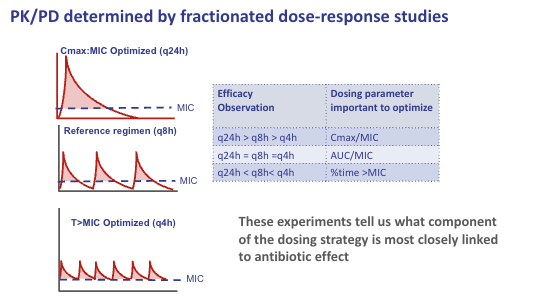
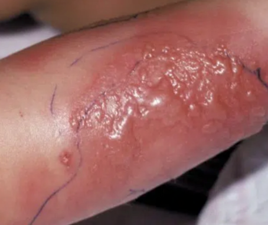
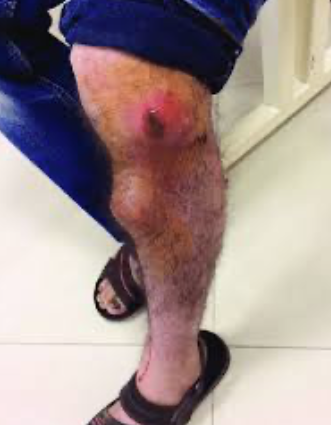
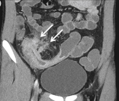
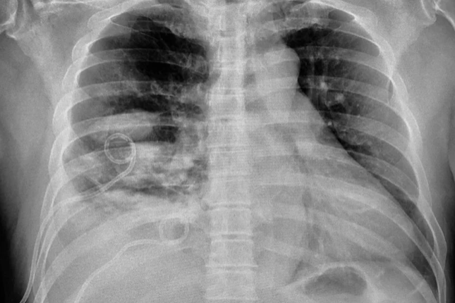
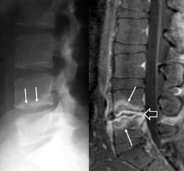
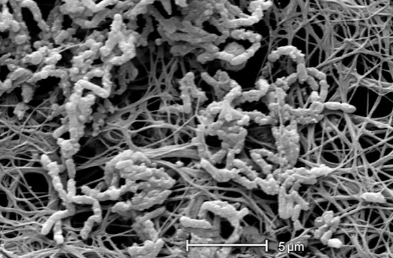

# Pharmacokinetic/Pharmacodynamic (PK/PD) Indices

## Three Patterns of Antibiotic Killing

One of the most important advances in modern antibiotic therapy is the
recognition that antibiotics do not all kill bacteria in the same way.
The relationship between drug concentrations and antimicrobial efficacy
is described by **pharmacokinetic/pharmacodynamic (PK/PD) indices**,
which link measurable drug exposure parameters to microbiological
outcomes. Understanding these indices allows clinicians to rationally
optimize dosing regimens rather than relying on one-size-fits-all
approaches.

{fig-align="center"
width="80%"}

Three fundamental PK/PD patterns have been identified:

**Concentration-dependent killing (Peak/MIC).** For these antibiotics,
the *height* of the peak concentration relative to the MIC is the
primary driver of bacterial killing. The higher the peak above the MIC,
the more rapid and complete the bactericidal effect. Drugs in this
category include aminoglycosides, fluoroquinolones, and polymyxins.
Clinical implication: when treating infections with higher MICs, it may
be preferable to give a single higher dose rather than multiple smaller
doses.

**Time-dependent killing (T \> MIC).** For these antibiotics, efficacy
depends on how long the drug concentration remains above the MIC during
the dosing interval. Increasing the peak concentration does not
substantially improve killing — what matters is *duration of exposure*.
This pattern is characteristic of beta-lactams (penicillins,
cephalosporins, carbapenems, monobactams) and macrolides. Animal and
clinical studies have established that maintaining concentrations above
the MIC for at least 40–50% of the dosing interval is generally
associated with efficacy.

**Exposure-dependent killing (AUC/MIC).** These antibiotics exhibit a
mixture of both time- and concentration-dependent activity. The total
drug exposure over 24 hours — represented by the area under the
concentration–time curve (AUC) divided by the MIC — best predicts
outcomes. Vancomycin, tetracyclines, and linezolid fall into this
category.

## How PK/PD Indices Are Identified

## Dose Fractionation Studies in Antimicrobial Pharmacodynamics

Dose fractionation experiments are a cornerstone methodology for
identifying which PK/PD index best predicts antimicrobial efficacy. The
fundamental design is elegant: a fixed total daily dose is administered
to infected animals (typically neutropenic murine thigh or lung
infection models) but divided into different dosing intervals — for
example, the same total mg/kg/day given as a single dose (q24h), split
into two doses (q12h), three (q8h), or six (q4h).

Because the total drug exposure (AUC) remains constant across all
regimens while the shape of the concentration-time curve changes
dramatically, you can tease apart which PK/PD driver matters most:

**If the q24h regimen wins** (produces the greatest bacterial kill or
survival), the drug achieves the highest peak concentrations, and
efficacy is driven by **Cmax/MIC**. This is the classic pattern for
aminoglycosides and daptomycin — concentration-dependent killing where
you want to hit hard with large, infrequent doses.

**If all regimens perform equally**, efficacy depends only on total
exposure regardless of how it's distributed over time, pointing to
**AUC/MIC** as the predictive index. Fluoroquinolones, azithromycin, and
most antifungals (including the azoles and echinocandins) follow this
pattern. Notably, AUC/MIC-driven drugs can still show
concentration-dependent killing in time-kill curves; the fractionation
study reveals that what ultimately matters in vivo is cumulative
exposure.

**If the q4h regimen wins**, splitting the dose into frequent small
administrations keeps concentrations above the MIC for the longest
fraction of the dosing interval, identifying **%T\>MIC** as the key
driver. This is the signature of beta-lactams and, to a degree,
linezolid — time-dependent killing where prolonged exposure above
threshold matters more than peak height.

As the figure below illustrates, the three PK/PD curve shapes are
visually distinct: the q24h-optimized profile shows tall, sharp peaks
well above MIC; the AUC-driven profile shows equivalent areas under all
regimens; and the T\>MIC-optimized profile shows low, sustained
concentrations hovering above the MIC line.

These experiments, pioneered largely by Craig and Andes at Wisconsin,
translated directly into clinical dosing strategies — continuous or
extended infusions for beta-lactams, once-daily aminoglycoside dosing,
and AUC-guided vancomycin monitoring. They remain the standard
preclinical framework for establishing PK/PD targets that then inform
clinical breakpoints, dose optimization, and Monte Carlo simulation
work.

{fig-align="center" width="789"}

This is a classic dose fractionation result for a cephalosporin. The
same dataset (CFU/thigh at 24 hours in a neutropenic mouse thigh
infection model) is plotted against all three candidate PK/PD indices
simultaneously:

In the **Cmax/MIC panel** (left), the data points are scattered with no
coherent relationship — you can achieve the same peak-to-MIC ratio and
get wildly different bacterial burdens, ranging from near-baseline
(\~7.3 log, the dashed stasis line) to maximal kill or no kill at all.

The **AUC/MIC panel** (centre) shows a similar scatter. Total exposure
alone does not predict outcome.

The **%T\>MIC panel** (right) reveals a tight sigmoidal relationship (R²
= 0.94). As the percentage of the dosing interval with concentrations
above MIC increases, bacterial burden drops progressively. Below about
25–30% T\>MIC, there is essentially no efficacy (CFU remain at or above
stasis). Maximal kill plateaus once T\>MIC reaches roughly 60–70%.

This is the definitive demonstration that beta-lactams are
time-dependent killers. The clinical translation is direct: you don't
need higher peaks, you need longer exposure above MIC — hence the
rationale for extended or continuous infusions of beta-lactams, and why
dosing interval matters more than dose size for this drug class.

## From Animal Model to Clinical Validation — AUC/MIC Target for Fluoroquinolones

This figure below illustrates a critical step in PK/PD-guided drug
development: translating an animal-derived target to human outcomes.

The **left panel** shows ciprofloxacin in a murine *P. aeruginosa*
pneumonia model. Mortality rate is plotted against the 24-hour AUC/MIC.
There is a steep sigmoid relationship: mortality is essentially 100% at
low AUC/MIC values, then drops sharply to near zero once AUC/MIC exceeds
approximately **125**. This identifies the animal-derived PK/PD target.

The **right panel** validates this same threshold in humans — patients
with ventilator-associated pneumonia treated with fluoroquinolones. When
clinical and microbiological cure rates are stratified by achieved
AUC/MIC, there is a dramatic jump in outcomes at the 125–250 bracket
(88% microbiological cure, 81% clinical cure) compared to lower strata.
Below an AUC/MIC of 125, cure rates are poor (≤40% microbiological, ≤30%
clinical). Interestingly, outcomes plateau or even slightly decline at
very high AUC/MIC values, which likely reflects confounding — patients
with highly susceptible organisms (low MICs, thus high AUC/MIC ratios)
may have had less virulent infections.

Taken together, these panels demonstrate the "bench-to-bedside" PK/PD
pipeline: animal dose fractionation identifies AUC/MIC as the driver and
defines a target of \~125, and clinical outcome data in critically ill
patients confirms that this same threshold discriminates success from
failure. This AUC/MIC ≥ 125 target for fluoroquinolones against
Gram-negatives has become one of the most widely cited PK/PD benchmarks
and underpins breakpoint setting, Monte Carlo dosing simulations, and
clinical dosing recommendations.

These studies have consistently shown that specific PK/PD targets
predict clinical success. For example, for beta-lactams, a T \> MIC of
40–50% is typically associated with microbiological efficacy, while for
aminoglycosides a Peak/MIC ratio of 8–10 is optimal [@craig_1998;
@drusano2004].

{fig-align="center"}

## PK/PD Characteristics of Common Antibiotic Classes

The table below summarises the PK/PD classification of major antibiotic
families and the corresponding optimisation strategies.

{fig-align="center"}

::: callout-tip
## Clinical Pearl — Dosing Strategy Follows the PK/PD Index

For **concentration-dependent** drugs (aminoglycosides): give infrequent
high doses (e.g., once-daily dosing). For **time-dependent** drugs
(beta-lactams): give frequent doses or use extended/continuous
infusions. For **AUC/MIC-dependent** drugs (vancomycin): optimise total
daily exposure through AUC-guided monitoring.
:::

# Application: Model-Based Antibiotic Dosing Optimisation

## From Population Models to Individualised Therapy

The practical importance of PK/PD indices is that they enable
**model-based dosing** — a mathematically guided approach to
individualising antibiotic therapy for each patient. This is
particularly critical in the intensive care unit, where the
pharmacokinetics of antibiotics are profoundly altered and the
coefficient of variation in drug exposure can reach 80–100%.

The approach works as follows:

1.  **Population pharmacokinetic models** are developed by studying
    hundreds or thousands of patients who received the drug. These
    models identify the clinical covariates (e.g., renal function,
    weight, albumin level, dialysis status) that significantly affect
    drug clearance and volume of distribution.

2.  An **a priori prediction** is generated for a new patient based on
    their clinical characteristics. This provides a probability estimate
    that a given dosing regimen will achieve the PK/PD target (e.g.,
    sufficient T \> MIC for a beta-lactam).

3.  **Therapeutic drug monitoring (TDM)** — measuring an actual drug
    level in the patient's blood — is used to validate or refine the
    model prediction. If the measured concentration differs from the
    prediction, the model is adjusted (*Bayesian updating*) to produce a
    dosing regimen specific to that individual patient.

4.  As the patient's clinical status changes (e.g., declining renal
    function, fluid shifts), the model can be **continuously updated**
    to maintain optimal exposure.

## Worked Example: Meropenem Dosing in the ICU

Consider a 35-year-old patient (70 kg, 170 cm) admitted after a motor
vehicle accident who is becoming hypotensive and requires empirical
broad-spectrum antibiotic therapy. Meropenem 1 g infused over 30 minutes
every 8 hours (the standard licensed dose) is initiated.

Using a population PK model for meropenem in critically ill patients, we
can predict the concentration–time profile. For a susceptible pathogen
with an MIC of 2 mg/L (e.g., *E. coli*), the model estimates a T \> MIC
of approximately 93% — comfortably above the 40–50% target needed for
efficacy.

**But what if the MIC is 16 mg/L?** Now the time above MIC falls to
approximately 18–20%, well below the target. Simply doubling the dose to
2 g achieves only marginally better T \> MIC, while producing
dangerously high peak concentrations (approaching the seizure threshold
of approximately 100 mg/L). The additional drug is essentially "wasted"
— eliminated renally without contributing to bacterial killing.

::: callout-important
## Extended Infusion — Optimising Time-Dependent Killing

The solution exploits the PK/PD principle: since meropenem is
time-dependent, we need to increase *duration of exposure*, not peak
concentration. By infusing 1 g over 7.5 hours (instead of 30 minutes)
every 8 hours, the T \> MIC improves dramatically — approaching 100%
even against the higher MIC target. Meropenem must be changed every 8
hours because of limited stability in solution, so a 7.5-hour infusion
(with 30 minutes for the changeover) maximises infusion time within this
constraint.
:::

This model-based approach also allows clinicians to ask "what if"
questions: *What if renal function declines? What if we need to cover a
less susceptible pathogen?* The interactive TDMx platform
(<https://www.tdmx.eu/Launch-TDMx/>) allows exploration of these
scenarios for meropenem and other antibiotic classes such as
aminoglycosides [@Abdul-Aziz2015; @kothekar2020].

## Hepatic Clearance and Drug Interaction Screening

Not all antibiotics are cleared renally. Several important
antimicrobials (e.g., metronidazole, rifampin, certain macrolides,
antifungals) undergo significant hepatic metabolism. For these drugs,
hepatic dysfunction and drug–drug interactions become the primary
concerns for dose adjustment.

{fig-align="center"}

Clinicians should routinely screen for drug interactions — particularly
when using rifampin (a potent inducer of cytochrome P450 enzymes), azole
antifungals (CYP inhibitors), or macrolides — using resources such as
[UpToDate](https://www.uptodate.com/contents/search) or similar drug
interaction databases.

# Site-Specific Limitations of Antibiotic Activity

## Daptomycin Inactivation in the Lung

Daptomycin is one of the most important antibiotics available for
treating methicillin-resistant *Staphylococcus aureus* (MRSA). It is a
rapidly bactericidal, concentration-dependent lipopeptide that was
originally developed by Eli Lilly in the 1980s but abandoned after phase
II trials revealed rhabdomyolysis (muscle damage leading to renal
failure) when given three times daily. A biotech company (Cubist
Pharmaceuticals) later applied PK/PD principles to recognise that
daptomycin was concentration-dependent — a single daily dose both
improved killing and reduced the risk of rhabdomyolysis (which was
caused by persistent trough concentrations).

However, daptomycin has a critical limitation: **it is inactivated by
pulmonary surfactant**. When daptomycin enters the lungs, it binds to
surfactant and loses antimicrobial activity. This was discovered during
a clinical trial for community-acquired pneumonia, in which daptomycin
failed to demonstrate efficacy.

{fig-align="center"}

::: callout-warning
## Clinical Rule

**Never use daptomycin to treat pneumonia** — regardless of the
pathogen's susceptibility. It will not achieve adequate antimicrobial
activity in the pulmonary compartment. Although the drug could
theoretically treat hematogenously-spread infection to the lung; in
alveolar spaces the drug will not be effective.
:::

## Antibiotic Activity in Abscesses

Abscesses and large haematomas present another challenging environment
for antibiotics. Several factors conspire to reduce drug activity:

-   **Aminoglycosides** are bound and inactivated by purulent material.
    Low oxygen tension in abscesses impairs the active uptake of
    aminoglycosides into bacteria.
-   **Penicillins and tetracyclines** are bound by haemoglobin and have
    reduced activity in the presence of haematoma formation.
-   **Low pH** within abscesses further reduces the activity of many
    antibiotic classes.

{fig-align="center"}

::: callout-important
## Source Control Is Essential

This is precisely why the management of many infections requires
**source control** — surgical drainage of abscesses, evacuation of
haematomas, or removal of infected prosthetic material. Antibiotics
alone cannot reliably eradicate bacteria in these protected
environments.
:::

# Principle 7: De-escalate Antibiotic Therapy Based on Microbiology Results and Clinical Biomarker Responses

## The Rationale for De-escalation

Once microbiological data become available — typically 48–72 hours after
cultures are obtained — clinicians should narrow the spectrum of
antibiotic therapy to target only the identified pathogen(s). This
**de-escalation** strategy reduces collateral damage to the patient's
microbiome, lowers the risk of *Clostridioides difficile* colitis, and
minimises selection pressure for antibiotic resistance
[@spellbergPrinciplesAntibioticTherapy2025].

{fig-align="center"}

Key opportunities for de-escalation include:

-   **Stopping empirical vancomycin** when blood cultures grow only
    Gram-negative bacilli (no MRSA isolated).
-   **Stopping broad-spectrum anti-resistant pathogen therapy** when
    cultures reveal susceptible organisms.
-   **Narrowing from combination therapy to monotherapy** when a single
    effective agent is identified.

Remember: every additional day of unnecessary antibiotic therapy carries
an approximately 3% increased risk of adverse drug events [@tamma2017b].

## Biomarkers for Guiding De-escalation

### Fever and Leukocytosis

The most classic clinical markers of infection response are
**temperature** and **white blood cell count**. For most infections,
some improvement in both should be evident within 48–72 hours of
initiating effective therapy. Persistent fever and leukocytosis beyond
this window should prompt reconsideration of the diagnosis, adequacy of
source control, or appropriateness of antibiotic selection.

### C-Reactive Protein (CRP)

CRP is a non-specific marker of inflammation that rises in response to
bacterial infection (particularly Gram-negative sepsis) and declines
with successful treatment. However, its clinical utility for guiding
antibiotic decisions is debated because it responds to many
non-infectious inflammatory stimuli.

### Procalcitonin (PCT)

Procalcitonin is a biomarker that rises more specifically in response to
bacterial infections, especially Gram-negative sepsis. Multiple studies
have demonstrated that **procalcitonin-guided algorithms** can safely
reduce antibiotic duration — when procalcitonin declines below a
threshold value, antibiotics can be discontinued with confidence
[@schuetzProcalcitoninGuideInitiation2012].

{fig-align="center"}

::: callout-note
## The Procalcitonin Paradox

In practice, many clinicians use procalcitonin asymmetrically: they
*ignore* negative results (which should prompt antibiotic
discontinuation) while using positive results to *justify* continued
therapy. This undermines the very purpose of the test. Procalcitonin
requires its own stewardship programme and clear institutional
guidelines for appropriate interpretation.
:::

## Gram Stain–Guided Therapy

The initial Gram stain remains a critical tool for early antibiotic
selection: it immediately classifies the pathogen as Gram-positive or
Gram-negative, allowing prompt narrowing of therapy even before full
culture results are available.

A recent randomised clinical trial published in *JAMA Network Open*
(GRACE-VAP trial) demonstrated that Gram stain–guided antibiotic
selection for ventilator-associated pneumonia resulted in:

-   A **30% reduction** in use of anti-pseudomonal agents
-   A **40% reduction** in MRSA-directed agents
-   Higher rates of appropriate antibiotic escalation (7% vs. 1%)

{fig-align="center" width="80%"}

These results confirm that investing in rapid microbiological
diagnostics — even something as simple as a Gram stain — leads to more
appropriate antimicrobial therapy and shorter courses of treatment
[@yoshimura2022].

## Interpreting Susceptibility Testing — Beyond S, I, and R

When susceptibility results return, many clinicians simply look for "S"
(susceptible) and choose accordingly. However, this approach is
dangerously oversimplified, particularly when dealing with resistant
pathogens.

{fig-align="center"}

::: callout-warning
## Critical Interpretation Points

Consider a blood culture isolate of a KPC-producing *Klebsiella
pneumoniae* that reports **ceftazidime-avibactam S (MIC \< 1)**,
**colistin S (MIC 1)**, and **amikacin S**:

1.  **Ceftazidime-avibactam** has an MIC well below its breakpoint of 8
    — the 3–4 dilution margin provides genuine confidence in efficacy.
2.  **Colistin** has an MIC of 1, which is only one dilution below the
    resistance breakpoint of 2. Given that MIC testing has an inherent
    error of plus or minus one dilution (performing the test 10 times
    could yield results of 0.5, 1, 2, or even 4), this "S" result is
    essentially unreliable. Furthermore, colistin is clinically inferior
    — it is nephrotoxic, neurotoxic, has poor lung penetration, and
    carries high rates of spontaneous resistance.
3.  **Amikacin** alone is insufficient as monotherapy for serious
    Gram-negative bloodstream infections.

The infectious disease specialist would recognise ceftazidime-avibactam
as the clearly superior option, potentially combined with amikacin for
the first 2–3 days until bloodstream clearance is confirmed. *S does not
always mean S* — the clinical context, PK/PD characteristics, and
limitations of the MIC test itself must all be considered.
:::

Antibiotic stewardship programmes can leverage **selective reporting**
by the microbiology laboratory — reporting only the most appropriate
agents for a given pathogen — to guide clinician behaviour toward
optimal antibiotic selection [@mouton2012].

# Principle 8: If Therapy Is Not Working, Consider Source Control or Alternative Diagnosis Before Assuming Resistance

## Recognising Treatment Failure

If the following parameters do not improve within 48–72 hours of
initiating appropriate antibiotic therapy, treatment failure should be
considered:

-   Persistent or worsening **fever**
-   Elevated **white blood cell count**
-   Continuing **purulent secretions**
-   Signs of inflammation: *rubor* (redness), *tumor* (swelling),
    *dolor* (pain), *calor* (warmth)
-   Stagnant or rising **biomarkers** (procalcitonin, CRP)

::: callout-tip
## Practical Tip — The Pen Test for Cellulitis

For cellulitis, draw a line around the advancing edge of erythema with a
pen. While examining the patient after 12–24 hours, determine if the
line of erythema is receding from the line- this suggests the therapy is
working. If it is advancing beyond the line, therapy may be failing.

{fig-align="center"}

Cellulitis due to *Staphylococcus aureus*. Note lines are progressively
drawn around edge of erythema to document response to therapy
:::

## Source Control — The Most Common Cause of Antibiotic Failure

Before assuming antibiotic resistance, clinicians must systematically
evaluate whether there is an anatomical source that antibiotics cannot
adequately penetrate:

| Occult subcutaneous abscess in cellulitis | New abscess formation in intra-abdominal infection | Empyema in community-acquired pneumonia | Visceral or skeletal abscess in bacteraemia | Failure to remove an infected central venous catheter |
|:-------------:|:-------------:|:-------------:|:-------------:|:-------------:|
|  |  |  |  |  |

: Common source control problems requiring surgical or procedural
intervention. {.striped}

For many infections — particularly complicated cellulitis,
intra-abdominal infections, and empyema — **the most important
therapeutic intervention is not the antibiotic but the surgical
procedure** (incision and drainage, percutaneous drainage, chest tube
placement).

## Biofilms: A Key Source of Antibiotic Failure

When bacteria colonise prosthetic materials (central venous catheters,
prosthetic joints, heart valves, urinary catheters), they form
**biofilm** — a glycopolysaccharide matrix that protects bacteria from
both immune cells and antibiotics. Within a biofilm, bacteria exist in a
spectrum of metabolic states: surface bacteria are metabolically active,
but deeper layers become progressively dormant ("zombie" bacteria).
Because beta-lactams require actively dividing bacteria to exert their
effect, these dormant cells are intrinsically tolerant.

{fig-align="center"}

Over time, fragments of biofilm detach and seed distant sites, causing
recurrent bacteraemia.

**Management of catheter-related biofilm infections:**

-   **High-virulence organisms** (e.g., *S. aureus*, *Candida* spp.,
    *Pseudomonas aeruginosa*): the catheter **must be removed**. The
    risk of haematogenous seeding to bones, heart valves, and other
    sites is too high to justify salvage attempts.
-   **Low-virulence organisms** (e.g., coagulase-negative
    staphylococci): catheter salvage with **antibiotic lock therapy**
    may be attempted, particularly if the catheter cannot easily be
    replaced. However, this approach is **never curative** — it only
    reduces the inoculum and delays recurrence.

::: callout-note
## The Unmet Need

If effective anti-biofilm therapies were developed, it would
revolutionise the management of prosthetic device infections, urinary
catheter infections, and many forms of recurrent bacteraemia. This
remains one of the greatest unmet needs in infectious disease.
:::

## The FAIL Mnemonic

When a patient fails to respond to antibiotic therapy, systematically
consider the **FAIL** construct:

-   **F** — **False diagnosis** (wrong pathogen, non-infectious cause of
    fever such as malignancy, drug fever)
-   **A** — **Allergies** (antibiotic-associated fever or rash; consider
    whether the antibiotic itself is causing the persistent fever)
-   **I** — **Intercurrent infections** (a new or secondary infection
    has developed)
-   **L** — **Localised process** (undrained abscess, infected
    prosthetic material, catheter-related infection)

::: callout-warning
## Antibiotic-Associated Fever

The longer a patient remains on antibiotics — particularly multiple
agents — the greater the risk of **drug fever**. A clinically stable
patient with low-grade fever on multiple antibiotics should prompt
consideration of whether one of the antibiotics is the cause. This is
particularly common in haematology-oncology patients receiving prolonged
empirical therapy without a microbiological diagnosis. Antibiotic
associated fever should be part of the differential diagnosis in any
patient with rash and/or eosinophilia. Additionally, clinicians should
recognize the underlying disease processes can also be associated with
fever (e.g., active lymphoma, solid tumors, etc.)
:::

# Principle 9: Distinguish New Infection from Failure of Initial Therapy

New onset of infectious signs, symptoms, and biomarkers **after initial
resolution** should raise concern for a **new infection** rather than
persistence of the original one. Rarely, recrudescence may reflect
emergence of antibiotic resistance from the initial pathogen — this is
more commonly seen with certain organisms such as *Acinetobacter
baumannii*.

Key management principles:

-   Perform a **complete diagnostic re-evaluation**: new blood cultures,
    imaging, and clinical reassessment.
-   It is generally reasonable to **broaden therapy** to cover highly
    resistant pathogens, as these patients have been exposed to recent
    antibiotics and carry a higher risk of resistant organisms.
-   When changing antibiotics for breakthrough infection, **change one
    drug at a time** (to a different class if possible) to preserve the
    ability to assess which change was effective.
-   If no source is identified despite thorough evaluation, it may
    ultimately be necessary to **stop all antibiotics** and allow the
    infection to "redeclare itself" — because continuing empirical
    therapy without a diagnosis will progressively reduce the
    probability of ever making one.

# Principle 10: Shorter Is Better — Duration of Therapy Should Be Evidence-Based

## The Shift from Tradition to Evidence

Historically, antibiotic treatment durations were based on tradition and
clinical authority rather than evidence. Standard recommendations of 7,
14, 21, or 42 days — always fitting neatly into weekly multiples — were
handed down through generations of teaching. These durations were never
rigorously tested because early antibiotics were so obviously effective
that formal duration trials were not conducted.

Over the past decade, numerous randomised controlled trials have
systematically examined whether shorter courses are as effective as
longer ones. The consistent finding has been with a few exceptions:
**shorter is better**. Therefore, clinicians should recommend the
shortest courses of antibiotic therapy supported by clinical evidence
(examples are below).

## Evidence for Short-Course Therapy

| Infection | Short course (days) | Long course (days) | Outcome |
|------------------|------------------|------------------|------------------|
| Bacteraemia, Gram-negative | 7 | 14 | Equivalent |
| Chronic bronchitis / COPD | $\leq$ 5 | $\geq$ 7 | Equivalent |
| Intra-abdominal infection | 4 | 10 | Equivalent |
| Neutropenic fever | Until afebrile and stable | Until afebrile, stable, and non-neutropenic | Equivalent |
| Osteomyelitis, chronic | 42 | 84 | Equivalent |
| Pneumonia, community-acquired | 3–5 | 7–10 | Equivalent |
| Pneumonia, nosocomial (incl. VAP) | $\leq$ 8 | 10–15 | Equivalent |
| Pyelonephritis | 5–7 | 10–14 | Equivalent |
| Skin infections (cellulitis, abscess, wound) | 5–6 | 10–14 | Equivalent |
| Sinusitis, acute bacterial | 5 | 10 | Equivalent |

: Evidence-based short-course antibiotic therapy: all studies
demonstrated equivalent or lower mortality with shorter regimens
[@spellbergPrinciplesAntibioticTherapy2025]. {.striped}

::: callout-tip
## Why Shorter Can Mean Lower Mortality

In several studies, shorter courses were associated with *lower*
mortality than longer courses. The explanation is that shorter therapy
produces fewer breakthrough resistant infections, fewer drug adverse
events, and less disruption to the protective microbiome.
:::

# Common Myths of Antibiotic Therapy

## Myth 1: Bactericidal Antibiotics Are More Effective Than Bacteriostatic

### The Laboratory Definitions

The distinction between "bactericidal" and "bacteriostatic" is defined
*in vitro*:

-   **Bactericidal**: the concentration of drug that results in 3-log
    reduction in the bacterial incoulum, which at typical MIC test
    inoculums results in lack of grow when a sample (10 μL) is plated on
    agar
-   **Bacteriostatic**: the drug kills bacterial but does not kill
    bacteria below the 1000-fold threshold within 24 hours.

{fig-align="center" width="50%"}

However, this distinction is artificial — "bacteriostatic" drugs *do*
kill bacteria, just at a slower rate or requiring higher concentrations
to achieve the arbitrary 1000-fold threshold. All antibiotics kill; they
kill at different rates and at different inocula.

### The Evidence

A systematic literature review identified 49–56 randomised controlled
trials comparing bacteriostatic and bactericidal agents. The results
were unambiguous:

-   Time to bacterial clearance from bloodcultures often differed by
    less than 1 day or was equivalent

-   **49 of 56 trials found no difference** in clinical outcomes,
    including in highly lethal infections in critically ill patients
    (typhoid fever, severe pneumonia, severe sepsis).

-   **6 trials** actually found linezolid (classified as bacteriostatic)
    to be *superior* to bactericidal agents (vancomycin, teicoplanin, or
    cephalosporins).

-   Only 1 trial found a bactericidal agent (imipenem) superior to a
    bacteriostatic one (tigecycline) in VAP — but the tigecycline dose
    was subsequently shown to have been too low. A follow-up study using
    double the dose found no difference
    [@wald-dicklerBustingMythStatic2017].

### The Daptomycin vs. Vancomycin Example

Daptomycin — rapidly bactericidal — was widely expected to prove
clinically superior to vancomycin — a slow-killing agent — for *S.
aureus* bacteraemia. Despite its superior *in vitro* killing kinetics,
**no clinical trial has demonstrated superiority of daptomycin over
vancomycin** for this indication. Similarly, adding aminoglycosides to
beta-lactams to accelerate killing of staphylococci has not improved
clinical outcomes in trials, while increasing nephrotoxicity.

::: callout-note
## Historical Artifact — Endocarditis

The dogma that bactericidal antibiotics are required for endocarditis
may reflect early studies that compared high-volume-of-distribution
drugs (tetracyclines, macrolides — which achieve *low blood
concentrations*) to penicillins (low Vd — *high blood concentrations*).
The apparent inferiority of the "bacteriostatic" agents was likely due
to inadequate drug exposure in the bloodstream, not an intrinsic
difference in killing mechanism.
:::

## Myth 2: Oral Antibiotic Therapy Is Less Effective Than IV for Complex Infections

### The Traditional Teaching

For decades, clinicians were taught that serious infections —
particularly osteomyelitis, bacteraemia, and endocarditis — *required*
intravenous therapy. This dogma kept patients hospitalised for weeks
(e.g., 6 weeks of IV therapy for osteomyelitis) and exposed them to all
the risks of prolonged central venous catheterisation.

### The Evidence: Oral Is the New IV

Earlier failures with oral therapy (e.g., using oral sulfanilamide,
erythromycin, or tetracycline for osteomyelitis) reflected the use of
drugs with poor bioavailability that could not achieve concentrations in
blood and bone exceeding the pathogen MIC. Modern oral antibiotics —
particularly fluoroquinolones, linezolid, trimethoprim-sulfamethoxazole,
and others — have excellent bioavailability and achieve tissue
concentrations well above target MICs.

Systematic reviews and meta-analyses have now demonstrated:

-   **Osteomyelitis**: no difference between oral and IV therapy
-   **Bacteraemia**: outcomes actually *favoured* oral therapy
-   **Endocarditis**: outcomes actually *favoured* oral therapy

{fig-align="center"}

{fig-align="center"}

{fig-align="center"}

The superior outcomes with oral therapy are likely explained by lower
complication rates (no catheter infections, fewer drug errors, greater
patient satisfaction) rather than inherent superiority of the oral route
[@wald-dicklerOralNewIV2022].

### When Oral Therapy Is Not Appropriate

The switch to oral therapy requires that **all** of the following
conditions are met:

1.  The patient is **haemodynamically stable**
2.  The patient has a **functioning gastrointestinal tract** (will
    absorb the drug)
3.  The patient **can reliably take medications by mouth**
4.  An oral antibiotic with **adequate bioavailability** exists for the
    target pathogen

{fig-align="center"}

::: callout-note
## Emerging Options — Ultra-Long-Acting Antibiotics

New antibiotics with very long half-lives (administered every 1–2 weeks
by injection) are being explored as alternatives for conditions like
osteomyelitis: the patient receives an injection, goes home, and returns
to the day hospital two weeks later for the next dose. This approach
eliminates the need for both prolonged hospitalisation and daily oral
adherence.
:::

## Myth 3: Combination Therapy — The Good, the Bad, and the Ugly

### The Good: When Combination Therapy Is Beneficial

There are specific, well-established indications for combination
antibiotic therapy:

**1. Expanding the spectrum of coverage.** When the likely pathogen
spectrum cannot be covered by a single agent — for example, treating
community-acquired pneumonia with a beta-lactam (for *Streptococcus
pneumoniae*) plus a macrolide (for atypical pathogens such as
*Mycoplasma* or *Legionella*). Similarly, in ICU settings with high
rates of multi-drug resistance, two drugs may provide broader empirical
coverage.

**2. Preventing emergence of resistance in specific scenarios:**

-   **Tuberculosis**: slow growth, non-replicating persister cells in
    cavitary disease can achieve high bacterial densities with
    spontaneous resistance mutations. Multi-drug regimens (3–4 drugs)
    dramatically reduce the probability of resistance emergence.
-   **HIV and hepatitis C**: resistance converts a treatable/curable
    infection into a fatal illness, making combination therapy
    essential.

**3. Superior outcomes with two active agents for specific pathogen
biology:**

-   **Bone and joint infections**: non-replicating bacteria in biofilm
    respond poorly to beta-lactams alone. The addition of **rifampin**
    (which penetrates biofilm and kills dormant cells) — particularly in
    combination with a fluoroquinolone — has been associated with
    reduced relapse rates in prosthetic joint infections.
-   **Eukaryotic infections**: cryptococcal meningitis (amphotericin B +
    5-FC), protozoal infections (*Plasmodium*: primaquine added to kill
    hepatic hypnozoites), acute amoebic colitis (metronidazole + luminal
    agent), nematode infections (doxycycline added to kill *Wolbachia*
    commensals), and neurocysticercosis (albendazole + praziquantel for
    dual killing mechanisms and PK synergy).

**4. Exotoxin-producing infections.** In necrotising fasciitis caused by
streptococci or *Clostridium* species, the addition of a **protein
synthesis inhibitor** (clindamycin or linezolid) to backbone beta-lactam
therapy shuts down bacterial toxin production. This has been associated
with improved survival in retrospective studies.

{fig-align="center"}

### The Microbiological Rationale: Checkerboard Testing

In the laboratory, synergy between two antibiotics can be assessed using
a **checkerboard array**: the MICs of both drugs are measured
individually and in combination at multiple concentration ratios. If the
fractional inhibitory concentration (FIC) index is \< 0.5, the
combination is considered synergistic.

{fig-align="center"}

However, there is very little evidence that *in vitro* synergy testing
predicts clinical outcomes, and this test is almost never performed
routinely in clinical microbiology laboratories.

### The Bad: Redundant Combination Therapy for Typical Infections

For acute pyogenic bacterial infections, there is **very little
evidence** supporting routine use of two active agents:

-   These organisms are in planktonic (free-floating) growth, not
    multiple life cycle phases
-   There are no commensal organisms inside the bacteria to target
-   The pharmacology and killing activity of single agents is generally
    adequate

The classic example is ***Pseudomonas aeruginosa***. For decades,
clinicians were taught to always use combination therapy (typically an
aminoglycoside plus a beta-lactam) for Pseudomonas infections.
Meta-analyses have consistently found **no advantage** for dual therapy,
while combination regimens result in higher rates of nephrotoxicity and
microbiome disruption.

{fig-align="center"
width="80%"}

A pragmatic approach used in many centres is to initiate combination
therapy empirically (e.g., piperacillin-tazobactam plus an
aminoglycoside), then **discontinue the aminoglycoside after 2–3 days**
once blood culture results are available and the patient is clinically
improving. This limits toxicity while providing initial broad coverage
[@huCombinationAntibioticTherapy2013].

### The Ugly: Imperfect Data

Several areas remain genuinely uncertain:

-   **Fungal infections beyond cryptococcosis**: combination therapy for
    *Candida* infections has shown no clear benefit; for *Aspergillus*
    infections, there is possible benefit with echinocandins plus
    triazoles, but data remain incomplete.
-   **Does combination therapy prevent resistance?** Yes — for
    tuberculosis, HIV, and HCV. For acute pyogenic bacterial infections,
    the in vitro rationale exists but clinical proof is lacking. It may
    even be a **Pyrrhic victory**: more drugs mean greater selection
    pressure on the microbiome and potentially greater selection for
    multi-drug resistance.

# Conclusions

Antibiotic therapy represents one of the great miracles of modern
medicine — fundamentally altering the practice of medicine and saving
countless lives. Yet the incredible power of these drugs is fleeting:
resistance is an inevitable consequence of antibiotic use, and every
unnecessary dose accelerates its emergence.

The 10 Principles of Effective Antibiotic Therapy provide a framework
for responsible prescribing:

1.  **Start antibiotics promptly** when infection is suspected
2.  **Obtain cultures before therapy** whenever possible
3.  **Choose empirical therapy** based on the most likely pathogen and
    local resistance patterns
4.  **Understand PK/PD** to optimise dosing for the site and severity of
    infection
5.  **Adjust for the host** — consider renal function, hepatic
    clearance, and patient-specific factors
6.  **Know the site** — some drugs do not work in certain compartments
7.  **De-escalate** based on microbiology results and biomarker
    responses
8.  **Evaluate source control** before assuming resistance
9.  **Distinguish new infection** from treatment failure
10. **Keep it short** — evidence supports shorter courses for most
    infections

Three enduring myths must also be retired from clinical practice: the
bactericidal/bacteriostatic dichotomy is not clinically meaningful, oral
therapy is appropriate for many serious infections, and combination
therapy is beneficial only in specific well-defined scenarios.

Physicians bear the burden of using antibiotics effectively — to heal
and cure patients while preserving this extraordinary therapeutic
resource for future generations.

# References
